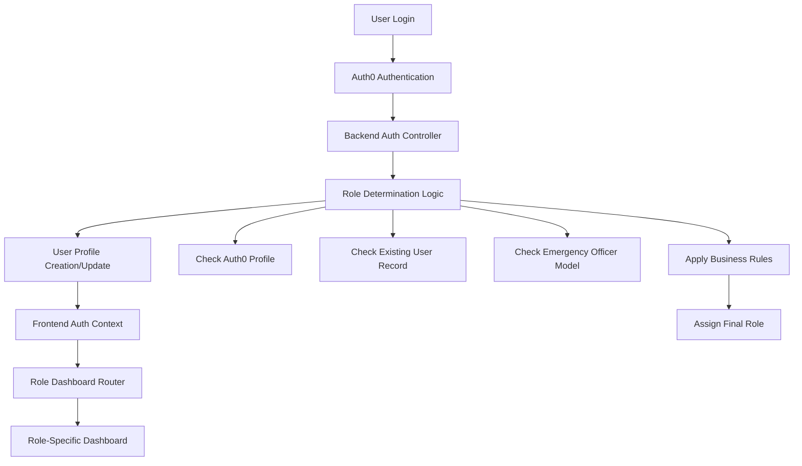

# Design Document

## Overview

This design addresses the critical issues in the role-based dashboard system by fixing the authentication flow, implementing proper role assignment logic, and ensuring all 8 user roles have fully functional dashboards. The solution focuses on three main areas: authentication context fixes, role determination logic, and dashboard component completeness.

## Architecture

### Current System Analysis

The current system has several architectural issues:

1. **Authentication Context Problem**: The `AuthContext.jsx` hardcodes fallback users with 'vet' role, overriding actual user roles
2. **Role Assignment Logic**: The `authController.js` has incomplete role determination logic that defaults to 'tourist' but gets overridden by fallback logic
3. **Dashboard Routing**: The `RoleDashboardRouter.jsx` correctly routes to dashboards, but some dashboard components are incomplete or missing
4. **Inconsistent Data Flow**: User role information flows through multiple layers with potential override points

### Proposed Architecture



## Components and Interfaces

### 1. Authentication Flow Components

#### Backend Authentication Controller (`authController.js`)
- **Purpose**: Handle user login, role determination, and profile management
- **Key Methods**:
  - `handleLogin()`: Enhanced role determination logic
  - `determineUserRole()`: New method for comprehensive role assignment
  - `getUserProfile()`: Return accurate user data with correct role

#### Frontend Authentication Context (`AuthContext.jsx`)
- **Purpose**: Manage user authentication state and role information
- **Key Changes**:
  - Remove hardcoded 'vet' role fallbacks
  - Respect backend-assigned roles
  - Implement proper error handling without role override

#### Role Dashboard Router (`RoleDashboardRouter.jsx`)
- **Purpose**: Route users to appropriate dashboards based on their role
- **Current State**: Already correctly implemented
- **Required Changes**: Minimal, ensure all dashboard imports are correct

### 2. Role Determination Logic

#### Enhanced Role Assignment Algorithm

```javascript
async function determineUserRole(userInfo, email, auth0Id) {
  // Priority 1: Check if user exists in specialized models
  const emergencyOfficer = await EmergencyOfficer.findOne({ Email: email });
  if (emergencyOfficer) return 'EmergencyOfficer';
  
  // Priority 2: Check existing user record
  const existingUser = await User.findOne({ 
    $or: [{ email }, { auth0Id }] 
  });
  if (existingUser && existingUser.role !== 'tourist') {
    return existingUser.role;
  }
  
  // Priority 3: Check Auth0 profile metadata
  if (userInfo.app_metadata?.role) {
    return userInfo.app_metadata.role;
  }
  
  // Priority 4: Business logic based on email domain or other criteria
  if (email.includes('@wildlanka.admin')) return 'admin';
  if (email.includes('@wildlanka.vet')) return 'vet';
  if (email.includes('@wildlanka.guide')) return 'tourGuide';
  if (email.includes('@wildlanka.driver')) return 'safariDriver';
  if (email.includes('@wildlanka.wildlife')) return 'WildlifeOfficer';
  if (email.includes('@wildlanka.call')) return 'callOperator';
  
  // Default: tourist (for public users)
  return 'tourist';
}
```

### 3. Dashboard Components Architecture

#### Dashboard Component Structure
Each dashboard follows a consistent structure:

```javascript
const RoleDashboard = () => {
  // State management
  const { backendUser } = useAuthContext();
  const [loading, setLoading] = useState(true);
  const [error, setError] = useState(null);
  const [activeTab, setActiveTab] = useState('overview');
  
  // Role-specific data states
  const [roleSpecificData, setRoleSpecificData] = useState([]);
  
  // Data fetching
  useEffect(() => {
    fetchRoleSpecificData();
  }, []);
  
  // Role verification
  if (backendUser?.role !== 'expectedRole') {
    return <AccessDenied />;
  }
  
  // Render dashboard with consistent layout
  return (
    <DashboardLayout>
      <Sidebar />
      <MainContent />
      <RightPanel />
    </DashboardLayout>
  );
};
```

#### Dashboard Component Status and Requirements

1. **AdminDashboard** ✅ - Already complete and functional
2. **VetDashboard** ✅ - Already complete and functional (VetDashboardSimple.jsx)
3. **TouristDashboard** ✅ - Already complete and functional
4. **CallOperatorDashboard** ✅ - Already complete and functional
5. **EmergencyOfficerDashboard** ✅ - Already complete and functional
6. **SafariDriverDashboard** ✅ - Already complete and functional
7. **TourGuideDashboard** ⚠️ - Needs verification and potential completion
8. **WildlifeOfficerDashboard** ⚠️ - Needs verification and potential completion

## Data Models

### User Model Enhancements

The existing User model already has the correct role enum:
```javascript
role: {
  type: String,
  enum: ['admin', 'callOperator', 'EmergencyOfficer', 'safariDriver', 'tourGuide', 'tourist', 'vet', 'WildlifeOfficer'],
  default: 'tourist',
}
```

### Role-Specific Data Models

Each role interacts with specific data models:

- **Admin**: User, Application, Activity, Event, Donation models
- **Vet**: AnimalCase, Treatment, Medication models
- **Tourist**: Activity, Event, Booking, Registration, Donation, Feedback, Complaint models
- **EmergencyOfficer**: Emergency, EmergencyForm models
- **CallOperator**: Emergency, EmergencyForm models
- **SafariDriver**: Tour, Vehicle, FuelClaim models
- **TourGuide**: Tour, TourGuide, Application models
- **WildlifeOfficer**: AnimalCase, Conservation, FieldReport models (may need creation)

## Error Handling

### Authentication Error Handling

1. **Token Verification Failures**: Return 401 without creating fallback users
2. **Database Connection Issues**: Return 500 with retry mechanism
3. **Role Assignment Failures**: Log error and assign 'tourist' as safe default
4. **Missing User Data**: Create user with determined role, not hardcoded role

### Dashboard Error Handling

1. **Access Denied**: Show clear message with contact information
2. **Data Loading Failures**: Show retry button and error details
3. **API Failures**: Graceful degradation with cached data when possible
4. **Network Issues**: Offline mode indicators and retry mechanisms

## Testing Strategy

### Unit Testing

1. **Role Determination Logic**: Test all role assignment scenarios
2. **Authentication Context**: Test state management and role persistence
3. **Dashboard Components**: Test role verification and data loading
4. **API Integration**: Test role-based data access

### Integration Testing

1. **End-to-End User Flows**: Test complete login-to-dashboard flow for each role
2. **Role Switching**: Test admin ability to change user roles
3. **Cross-Role Data Access**: Ensure users can't access unauthorized data
4. **Dashboard Navigation**: Test all dashboard features for each role

### Test Scenarios by Role

1. **Admin User**: Login → Admin Dashboard → User Management → Role Changes
2. **Vet User**: Login → Vet Dashboard → Animal Cases → Treatment Management
3. **Tourist User**: Login → Tourist Dashboard → Activity Booking → Event Registration
4. **Emergency Officer**: Login → Emergency Dashboard → Case Management → Response Coordination
5. **Call Operator**: Login → Call Operator Dashboard → Emergency Handling → Case Assignment
6. **Safari Driver**: Login → Safari Driver Dashboard → Tour Management → Vehicle Tracking
7. **Tour Guide**: Login → Tour Guide Dashboard → Tour Assignment → Client Management
8. **Wildlife Officer**: Login → Wildlife Officer Dashboard → Conservation Activities → Field Reports

## Security Considerations

### Role-Based Access Control

1. **Frontend Protection**: Dashboard routing based on verified roles
2. **Backend Authorization**: API endpoints protected by role middleware
3. **Data Isolation**: Users only access data appropriate to their role
4. **Session Management**: Role information persisted securely in session

### Authentication Security

1. **Token Validation**: Proper JWT verification without bypasses
2. **Role Tampering Prevention**: Role assignment only through backend logic
3. **Audit Logging**: Track role assignments and changes
4. **Fallback Security**: Safe defaults that don't grant excessive permissions

## Performance Considerations

### Dashboard Loading Optimization

1. **Lazy Loading**: Load dashboard components only when needed
2. **Data Caching**: Cache role-specific data to reduce API calls
3. **Progressive Loading**: Show dashboard shell while data loads
4. **Error Boundaries**: Prevent dashboard crashes from affecting entire app

### Authentication Performance

1. **Role Caching**: Cache role determination results
2. **Database Optimization**: Efficient queries for role lookup
3. **Token Reuse**: Minimize token refresh requests
4. **Connection Pooling**: Optimize database connections for auth operations

## Migration Strategy

### Phase 1: Fix Authentication Context
- Remove hardcoded role fallbacks
- Implement proper error handling
- Test with existing users

### Phase 2: Enhance Role Determination
- Implement comprehensive role assignment logic
- Add business rules for role determination
- Test role assignment accuracy

### Phase 3: Complete Dashboard Implementation
- Verify and complete missing dashboard components
- Ensure consistent UI/UX across all dashboards
- Test all role-specific functionality

### Phase 4: Testing and Validation
- Comprehensive testing of all roles
- User acceptance testing
- Performance optimization

## Monitoring and Maintenance

### Logging Strategy

1. **Authentication Events**: Log all login attempts and role assignments
2. **Dashboard Access**: Track dashboard usage by role
3. **Error Tracking**: Monitor authentication and dashboard errors
4. **Performance Metrics**: Track dashboard loading times and API response times

### Maintenance Procedures

1. **Role Audit**: Regular review of user role assignments
2. **Dashboard Updates**: Keep all dashboards synchronized with feature updates
3. **Security Reviews**: Regular security audits of role-based access
4. **Performance Monitoring**: Continuous monitoring of system performance